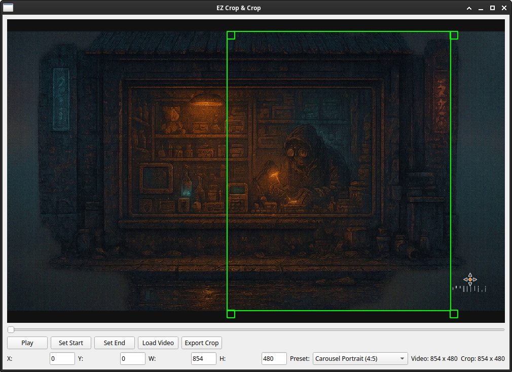

# EZ Crop & Crop



**EZ Crop & Crop** is the ultimate free desktop tool for **fast video cropping and trimming**, designed for content creators, marketers, and anyone posting to social media. Instantly crop and trim any video to **Instagram, TikTok, Reels, YouTube Shorts, or Facebook** format with pixel-perfect control—no advanced video editing skills required!

---

## ✂️ Features

- **Instant Cropping**: Drag and resize to set your crop, with live aspect ratio presets for every social platform.
- **Fast Video Trimming**: Select start/end times visually—no guesswork!
- **One-Click Export**: Outputs ready-to-upload files for Instagram, TikTok, YouTube Shorts, and more.
- **Presets for Social Media**:
  - Instagram Square (1:1)
  - Instagram Portrait (4:5)
  - Instagram Landscape (1.91:1)
  - Story/Reel (9:16)
  - Carousel Portrait, Square, and Landscape
- **Simple, Clean Interface**: Built with PyQt5. No learning curve.
- **No Watermarks**: 100% free, open source, and local—your files never leave your computer.
- **Drag & Drop**: Drop any video file to begin.

---

## 🚀 Why Use EZ Crop & Crop?

- **Optimize video for engagement** with proper social aspect ratios.
- **Repurpose existing content** for new channels in seconds.
- **Batch crop videos for clients or campaigns**—no need to open heavy NLEs.
- **Perfect for influencers, brands, agencies, and social video producers.**

---

## 📥 Download & Installation

1. **Download the latest version**:
    - [ez_crop_and_crop.py](https://raw.githubusercontent.com/YOUR_USERNAME/EZ-Crop-And-Crop/main/ez_crop_and_crop.py)

2. **Install dependencies**:
    ```bash
    pip install pyqt5 opencv-python-headless
    sudo apt install ffmpeg
    ```

3. **Run the tool**:
    ```bash
    python3 ez_crop_and_crop.py
    ```

---

## 🖼️ Screenshot


---

## ⚙️ Usage

1. **Load a video** (`Load Video` or drag and drop).
2. **Choose an aspect ratio preset** matching your social platform.
3. **Adjust the crop area** visually.
4. **Trim video** by setting start/end frames.
5. **Export**—ready for Instagram, TikTok, YouTube Shorts, Reels, and more.

---

## 💡 Roadmap / Ideas

- Export GIF/webp for memes/stickers
- Quick upload/share options
- Batch mode
- Advanced color filters

---

## 🔗 License

MIT License

---

**Keywords:**  
_video cropper, video trimmer, social media video tool, Instagram video crop, TikTok crop, YouTube Shorts crop, free, open source, PyQt5_

---

> Built by creators, for creators.  
> Contribute or suggest features via GitHub Issues!

